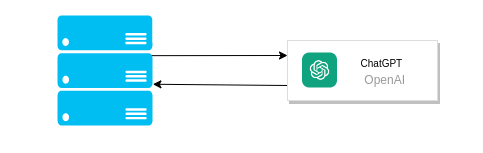

# Fit health API

## Description

API for [Fitness app](https://github.com/wojciechszmelczerczyk/fit-health-app).

## App status

Not Finished [❌]

## Table of contents

- [Techstack](#techstack)
- [Prerequisities](#prerequisities)
- [To run](#to-run)
- [Architecture](#architecture)
- [Endpoints](#endpoints)

## Techstack

- `Node`

## Prerequisities

- `Node` installed
- `OpenAI` configured

## To run

#### Clone repository

```
git clone https://github.com/wojciechszmelczerczyk/node-fit-health-api.git
```

#### Navigate to project

```sh
cd ./node-fit-health-api
```

#### Install dependencies

```
npm i
```

#### Setup env variables

<details>
<summary>env</summary>

```dockerfile

# OpenAI

OPENAI_API_KEY=


```

</details>

#### Run Express server

```
npm run start
```

## Architecture

Server side architecture use `OpenAI ChatGPT` for chatbot implementation.

Server communicate with third party API. Server architecture style is `REST`.

<details>
<summary>architecture</summary>


</details>

## Endpoints

| Method |               Endpoint               |
| :----: | :----------------------------------: |
|  POST  | [`/message`](./docs/post-message.md) |
